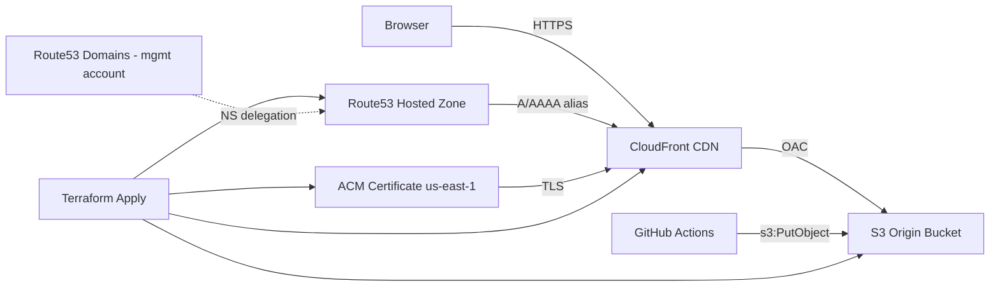

# Infrastructure

> **Status:** Confirmed — first deploy succeeded 2026-07-09.

## Overview

Static website for `doublejpropertygroup.com` served via CloudFront CDN with an S3 origin, HTTPS via ACM, and DNS in a Route53 hosted zone in the **deployment account**.

## Multi-account DNS

| Concern | Account | Details |
|---------|---------|---------|
| Domain registration | Management | Route 53 Domains — `doublejpropertygroup.com` |
| Hosted zone & records | Deployment | `Z07269821ABF121FF6QTS` |
| Terraform / infra | Deployment | GitHub Actions assumes role in deploy account |

Registrar nameservers in the management account **must match** the deployment-account hosted zone delegation set. After a zone is recreated, update nameservers at the registrar.

**Public delegation** (verified `dig NS doublejpropertygroup.com +short`, 2026-07-09):

```
ns-1143.awsdns-14.org.
ns-1724.awsdns-23.co.uk.
ns-22.awsdns-02.com.
ns-606.awsdns-11.net.
```

## Architecture diagram



## AWS resources

| Resource | Value | Notes |
|----------|-------|-------|
| S3 origin bucket | `doublejpg-use1-prod-website-origin` | Private; OAC access from CloudFront only |
| CloudFront distribution | `EKRXUVRSSY9H7` (`dgufm5rd50mv3.cloudfront.net`) | Alias: `doublejpropertygroup.com` |
| ACM certificate | `arn:aws:acm:us-east-1:072105303426:certificate/e9bd9f05-751f-4621-aa4f-a2173006ede8` | `us-east-1`; DNS validation |
| Route53 A/AAAA records | Zone `Z07269821ABF121FF6QTS` | Alias to CloudFront |
| CloudFront access log bucket | (created by module) | Enabled by default |
| Website URL | `https://doublejpropertygroup.com` | Returns 403 until site assets are deployed to S3 |

Cloud Posse label ID: `doublejpg-use1-prod-website`

## Terraform layout

| File | Purpose |
|------|---------|
| `terraform/context.tf` | Cloud Posse label context (`module.this`) |
| `terraform/acm.tf` | ACM certificate |
| `terraform/cdn.tf` | S3 + CloudFront + Route53 |
| `terraform/data.tf` | Route53 zone lookup |
| `terraform/outputs.tf` | Bucket name, distribution ID, URLs |

## Naming convention

Cloud Posse label ID: `doublejpg-use1-prod-website` (`namespace-environment-stage-name`)

## Deployment boundary

- **Infra:** GitHub Actions `terraform.yml` (plan on PR, apply on `main`)
- **Site assets:** future `s3 sync` + CloudFront invalidation workflow (not yet implemented)

Governance for AI/MCP-assisted changes: [`docs/AI-MCP-POLICY.md`](AI-MCP-POLICY.md)

## Post-deploy checklist

- [x] Record `terraform output s3_bucket_name` → `doublejpg-use1-prod-website-origin`
- [x] Record `terraform output cloudfront_distribution_id` → `EKRXUVRSSY9H7`
- [x] Record `terraform output acm_certificate_arn` → `arn:aws:acm:us-east-1:072105303426:certificate/e9bd9f05-751f-4621-aa4f-a2173006ede8`
- [x] Route53 records resolve for apex (A/AAAA → CloudFront)
- [x] Registrar NS match deployment-account hosted zone
- [x] ACM certificate issued
- [x] Terraform apply completed
