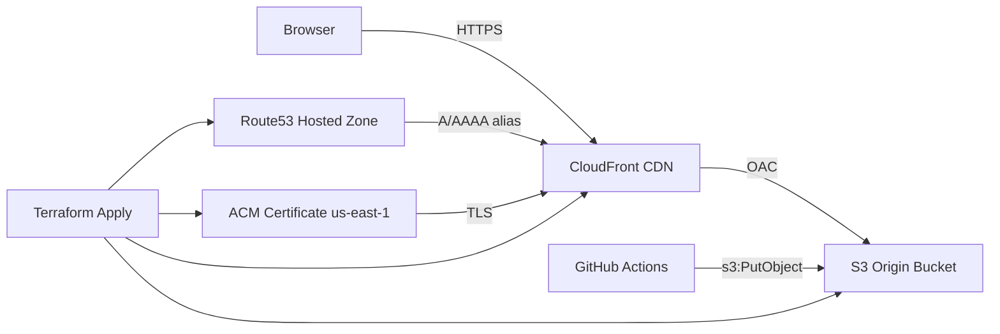

# Infrastructure

> **Status:** Expected architecture — to be confirmed after first deploy.

## Overview

Static website for `doublejpropertygroup.com` served via CloudFront CDN with an S3 origin, HTTPS via ACM, and DNS in an existing Route53 hosted zone.

## Architecture diagram

## AWS resources (expected)

| Resource | Module / source | Notes |
|----------|-----------------|-------|
| S3 origin bucket | `cloudposse/cloudfront-s3-cdn` | Private; OAC access from CloudFront only |
| CloudFront distribution | `cloudposse/cloudfront-s3-cdn` | Aliases: apex + optional www |
| ACM certificate | `cloudposse/acm-request-certificate` | `us-east-1`; DNS validation |
| Route53 A/AAAA records | `cloudposse/cloudfront-s3-cdn` | Alias to CloudFront in existing zone |
| CloudFront access log bucket | `cloudposse/cloudfront-s3-cdn` | Enabled by default |

## Terraform layout

| File | Purpose |
|------|---------|
| `terraform/context.tf` | Cloud Posse label context (`module.this`) |
| `terraform/acm.tf` | ACM certificate |
| `terraform/cdn.tf` | S3 + CloudFront + Route53 |
| `terraform/data.tf` | Route53 zone lookup |
| `terraform/outputs.tf` | Bucket name, distribution ID, URLs |

## Naming convention

Cloud Posse label ID: `djpg-use1-prod-website` (`namespace-environment-stage-name`)

## Deployment boundary

- **Infra:** GitHub Actions `terraform.yml` (plan on PR, apply on `main`)
- **Site assets:** future `s3 sync` + CloudFront invalidation workflow (not yet implemented)

Governance for AI/MCP-assisted changes: [`docs/AI-MCP-POLICY.md`](AI-MCP-POLICY.md)

## Post-deploy checklist

Revise this document after the first successful `terraform apply`:

- [ ] Confirm S3 bucket name from `terraform output s3_bucket_name`
- [ ] Confirm CloudFront distribution ID from `terraform output cloudfront_distribution_id`
- [ ] Confirm ACM certificate ARN from `terraform output acm_certificate_arn`
- [ ] Confirm Route53 records resolve correctly for apex (and www if enabled)
- [ ] Update resource table and diagram with actual values
- [ ] Change status above to **Confirmed**
