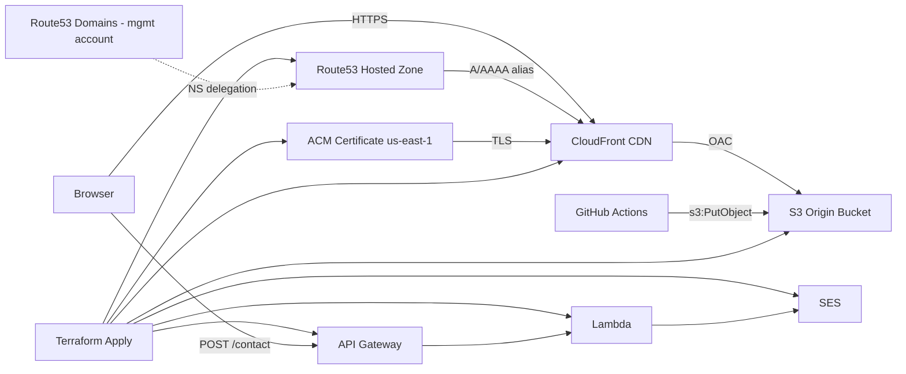

# Infrastructure

> **Status:** Confirmed — first deploy succeeded 2026-07-09.

## Overview

Static website for `doublejpropertygroup.com` served via CloudFront CDN with an S3 origin, HTTPS via ACM, and DNS in a Route53 hosted zone in the **deployment account**. Contact form submissions are handled by API Gateway, Lambda, and SES.

## Multi-account DNS

| Concern | Account | Details |
|---------|---------|---------|
| Domain registration | Management | Route 53 Domains — `doublejpropertygroup.com` |
| Hosted zone & records | Deployment | `Z07269821ABF121FF6QTS` |
| Terraform / infra | Deployment | GitHub Actions assumes role in deploy account |

Registrar nameservers in the management account **must match** the deployment-account hosted zone delegation set. After a zone is recreated, update nameservers at the registrar.

**Public delegation** (verified `dig NS doublejpropertygroup.com +short`, 2026-07-09):

```
ns-1143.awsdns-14.org.
ns-1724.awsdns-23.co.uk.
ns-22.awsdns-02.com.
ns-606.awsdns-11.net.
```

## Architecture diagram



## AWS resources

| Resource | Value | Notes |
|----------|-------|-------|
| S3 origin bucket | `doublejpg-use1-prod-website-origin` | Private; OAC access from CloudFront only |
| CloudFront distribution | `EKRXUVRSSY9H7` (`dgufm5rd50mv3.cloudfront.net`) | Alias: `doublejpropertygroup.com` |
| ACM certificate | `arn:aws:acm:us-east-1:072105303426:certificate/e9bd9f05-751f-4621-aa4f-a2173006ede8` | `us-east-1`; DNS validation |
| Route53 A/AAAA records | Zone `Z07269821ABF121FF6QTS` | Alias to CloudFront |
| CloudFront access log bucket | (created by module) | Enabled by default |
| Website URL | `https://doublejpropertygroup.com` | Static site in `site/` |
| Contact API | `terraform output contact_api_url` | API Gateway HTTP API → Lambda → SES |
| SES identity | `doublejpropertygroup.com` | Cloud Posse `ses` module — domain verification, DKIM, SPF |

Cloud Posse label ID: `doublejpg-use1-prod-website`

## Site structure

Static site source lives in [`site/`](../site/):

| File | Purpose |
|------|---------|
| `site/index.html` | Landing page (hero + contact form) |
| `site/404.html` | Branded not-found page |
| `site/403.html` | Branded forbidden page |
| `site/css/styles.css` | Shared styles |
| `site/js/contact.js` | Form validation and submission |
| `site/js/config.js` | API URL placeholder (injected at deploy) |
| `site/assets/logo.png` | Company logo |

## CloudFront error pages

CloudFront serves dedicated error pages with correct HTTP status codes:

| Origin error | Response page | HTTP status |
|--------------|---------------|-------------|
| 404 | `/404.html` | 404 |
| 403 | `/403.html` | 403 |

Configured in [`terraform/cdn.tf`](../terraform/cdn.tf) via `custom_error_response`.

## Terraform layout

| File | Purpose |
|------|---------|
| `terraform/context.tf` | Cloud Posse label context (`module.this`) |
| `terraform/acm.tf` | ACM certificate |
| `terraform/cdn.tf` | S3 + CloudFront + Route53 |
| `terraform/contact.tf` | SES + Lambda modules, HTTP API v2 resources, Lambda archive data source |
| `terraform/data.tf` | Route53 zone lookup |
| `terraform/outputs.tf` | Bucket name, distribution ID, contact API URL |

## Naming convention

Cloud Posse label ID: `doublejpg-use1-prod-website` (`namespace-environment-stage-name`)

## Deployment

### Infra (Terraform)

GitHub Actions [`terraform.yml`](../.github/workflows/terraform.yml):
- **PR:** plan posted as comment
- **Push to `main`:** apply

Creates/updates S3, CloudFront, ACM, Route53, SES, Lambda, and API Gateway resources.

### Site assets

GitHub Actions [`deploy.yml`](../.github/workflows/deploy.yml):
- **Trigger:** push to `main` when `site/**` changes (or manual `workflow_dispatch`)
- **Steps:**
  1. Read Terraform outputs (S3 bucket, CloudFront distribution ID, contact API URL)
  2. Inject contact API URL into `site/js/config.js`
  3. `aws s3 sync site/` to origin bucket
  4. CloudFront cache invalidation (`/*`)

**First-time order:** merge Terraform changes and wait for apply to complete (contact API must exist), then merge site changes to trigger deploy.

### Contact form

- Submissions POST to API Gateway `/contact` endpoint
- Lambda validates input and sends email via SES to `jeremy@doublejpropertygroup.com`
- CORS restricted to `https://doublejpropertygroup.com`
- API Gateway throttling: 5 req/s burst 10

**SES sandbox:** if the deployment account SES is in sandbox mode, verify the recipient email or request production access before the form can deliver mail.

Governance for AI/MCP-assisted changes: [`docs/AI-MCP-POLICY.md`](AI-MCP-POLICY.md)

## Post-deploy checklist

- [x] Record `terraform output s3_bucket_name` → `doublejpg-use1-prod-website-origin`
- [x] Record `terraform output cloudfront_distribution_id` → `EKRXUVRSSY9H7`
- [x] Record `terraform output acm_certificate_arn` → `arn:aws:acm:us-east-1:072105303426:certificate/e9bd9f05-751f-4621-aa4f-a2173006ede8`
- [x] Route53 records resolve for apex (A/AAAA → CloudFront)
- [x] Registrar NS match deployment-account hosted zone
- [x] ACM certificate issued
- [x] Terraform apply completed
- [x] Deploy site assets via `deploy.yml`
- [x] Verify contact form delivers to `jeremy@doublejpropertygroup.com`
- [x] Confirm 404/403 error pages render correctly
